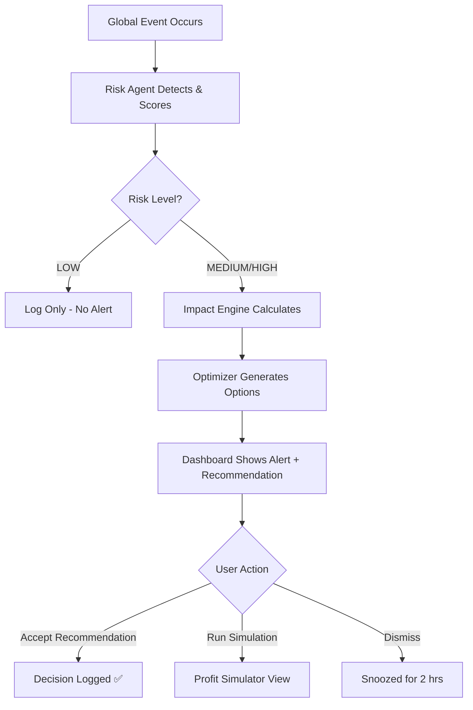
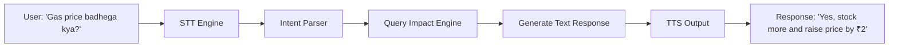

# Product Requirements Document: ResilientAI MVP

> **Product:** ResilientAI — Autonomous Supply Intelligence for MSMEs
> **Version:** MVP 1.0 | **Status:** Final | **Date:** 2026-03-27

---

## Table of Contents

1. [Executive Summary](#1-executive-summary)
2. [Problem Statement](#2-problem-statement)
3. [Product Vision](#3-product-vision)
4. [Goals and Success Metrics](#4-goals-and-success-metrics)
5. [User Personas](#5-user-personas)
6. [Core Features](#6-core-features)
7. [Feature Specifications](#7-feature-specifications)
8. [User Flows](#8-user-flows)
9. [Technical Architecture](#9-technical-architecture)
10. [Data Requirements](#10-data-requirements)
11. [AI/ML Requirements](#11-aiml-requirements)
12. [API Specification](#12-api-specification)
13. [Non-Functional Requirements](#13-non-functional-requirements)
14. [User Interface Requirements](#14-user-interface-requirements)
15. [Security and Privacy](#15-security-and-privacy)
16. [Rollout Strategy](#16-rollout-strategy)
17. [Success Metrics and KPIs](#17-success-metrics-and-kpis)
18. [Risks and Mitigations](#18-risks-and-mitigations)
19. [Out of Scope](#19-out-of-scope)
20. [Future Roadmap](#20-future-roadmap)
21. [Glossary](#21-glossary)

---

## 1. Executive Summary

ResilientAI is a decision intelligence platform that converts global supply chain disruptions into real-time, actionable recommendations for small and micro businesses (MSMEs). The system monitors global events, predicts local business impact, and recommends optimal decisions using Agentic AI and quantum-inspired optimization — all surfaced through a simple dashboard that any kirana store owner can use in under 60 seconds.

**Built for:** 36-hour hackathon sprint → production hardening over 4 weeks
**Core Stack:** Python · LangChain / CrewAI · Qiskit · Streamlit · FastAPI
**Target Users:** Kirana stores, small retailers, pharmacies, restaurants

> "We are not building a chatbot. We are building a decision intelligence system for resilient businesses."

---

## 2. Problem Statement

### Context

In an increasingly volatile global environment — geopolitical conflicts, energy crises, commodity shocks — supply chain disruptions cascade rapidly from global trade routes to local shelves.

**Example:** A closure of the Strait of Hormuz → LPG price spike → transport cost jump → product margin compression for a kirana store in Pune. This entire chain happens in days. The kirana owner finds out weeks later.

### The Gap

| What MSMEs Have Today | What They Actually Need |
|----------------------|------------------------|
| WhatsApp rumours | Verified, AI-qualified alerts |
| Reactive pricing | Predictive recommendations |
| Gut-instinct decisions | Quantum-optimized trade-off analysis |
| No foresight tools | Global → local impact mapping |

### Scale of Problem

- **63 million** MSMEs in India — the world's largest such ecosystem
- Estimated **15–25% revenue loss** per disruption event due to poor inventory/pricing decisions
- **Zero** affordable real-time supply intelligence tools built for this segment

---

## 3. Product Vision

**Short-term (MVP):**
Give any MSME owner a real-time "supply intelligence co-pilot" — an AI system that monitors global events, predicts cost impacts on their specific business, and recommends the single best action to take.

**Long-term:**
Become the operating system for supply resilience across all MSME verticals — kirana, pharma, restaurants, agri-logistics — powering decisions for millions of businesses through an AI platform that gets smarter with every disruption.

**Positioning:**
> "If Bloomberg Terminal is for Wall Street, ResilientAI is for Main Street."

---

## 4. Goals and Success Metrics

### Hackathon Goals (36 hrs)

- [ ] End-to-end demo flow working: Event → Alert → Impact → Recommendation
- [ ] Live or seeded data powering the dashboard
- [ ] Voice interaction (bonus)
- [ ] Judges can interact with the system themselves

### MVP Goals (90 days post-launch)

| Goal | Target |
|------|--------|
| Active MSME users | 200+ weekly active |
| Recommendation acceptance rate | ≥ 60% |
| Risk detection accuracy | ≥ 85% |
| NPS | ≥ 40 |
| Dashboard load time | < 2 seconds |

---

## 5. User Personas

### Persona 1 — Ramesh (Primary)

| Attribute | Detail |
|-----------|--------|
| **Role** | Kirana store owner |
| **Age** | 35–50 |
| **Location** | Tier 2/3 Indian city |
| **Income** | ₹40,000–₹80,000/month |
| **Digital Literacy** | Basic — uses WhatsApp, UPI, YouTube |
| **Goal** | Protect margins; never be caught off guard |
| **Frustration** | "I find out prices changed after I already stocked up wrong" |

**Jobs to Be Done:**
1. Know *when* to stock up before prices rise
2. Know *how much* to adjust prices without losing customers
3. Know *which* supplier to switch to during a crisis

---

### Persona 2 — Priya (Secondary)

| Attribute | Detail |
|-----------|--------|
| **Role** | Medical store owner |
| **Focus** | Pharma raw material supply chain |
| **Need** | Early warning on API/chemical import disruptions |

### Persona 3 — Anand (Secondary)

| Attribute | Detail |
|-----------|--------|
| **Role** | Restaurant/dhaba owner |
| **Focus** | LPG, vegetable, edible oil pricing |
| **Need** | Daily commodity forecast for menu costing |

---

## 6. Core Features

### P0 — Must Have (MVP / Hackathon)

| # | Feature | Value |
|---|---------|-------|
| 1 | **Risk Detection Agent** | Detects global supply events automatically |
| 2 | **Impact Prediction Engine** | Translates global risk → local cost impact in ₹/% |
| 3 | **Quantum-Inspired Optimizer** | Finds best decision across competing trade-offs |
| 4 | **Business Intelligence Dashboard** | Single-screen command center for MSME owner |

### P1 — Should Have (Post-Hackathon)

- Voice interaction (Hindi + English) via STT/TTS
- Profit simulation sandbox
- WhatsApp alert push integration

### P2 — Could Have (v1.5)

- Multi-sector support (pharma, restaurants)
- Supplier directory with alternatives
- Historical disruption analytics

---

## 7. Feature Specifications

### 7.1 Risk Detection Agent

**Purpose:** Monitor global news/datasets and classify supply disruption events.

**Input:** News headlines, RSS feeds, geopolitical datasets

**Processing:**
- Keyword extraction (NLP)
- Risk scoring: LOW / MEDIUM / HIGH
- Commodity class tagging (LPG, fuel, FMCG, pharma, agri)

**Output:**
```json
{
  "event": "Strait of Hormuz closure",
  "risk_level": "HIGH",
  "confidence": 0.92,
  "commodities_affected": ["LPG", "crude_oil", "transport"],
  "timestamp": "2026-03-27T10:30:00Z"
}
```

**Acceptance Criteria:**
- [ ] Alert fires within 5 minutes of qualifying event
- [ ] Confidence score displayed on every alert
- [ ] Handles false positives gracefully (LOW risk = log only, no alert)

---

### 7.2 Impact Prediction Engine

**Purpose:** Map global risk → quantified local business cost impact.

**Logic chain:**
```
Hormuz closure → LPG supply drops → LPG price +20%
→ Transport cost +12% → Product margin -8% → Demand -5%
```

**Output:**
```json
{
  "business_type": "kirana",
  "impact": {
    "LPG_price_change": "+20%",
    "transport_cost_change": "+12%",
    "product_margin_change": "-8%",
    "demand_change": "-5%"
  },
  "confidence_interval": "±3%"
}
```

**Acceptance Criteria:**
- [ ] Outputs predictions for ≥ 3 cost categories per event
- [ ] Shows confidence interval with every prediction
- [ ] Refreshes automatically when new risk data arrives

---

### 7.3 Quantum-Inspired Optimization Engine

**Purpose:** Evaluate multi-variable trade-off decisions using Qiskit (QAOA/VQE approximation).

**Decision options evaluated:**
1. Increase price
2. Stock additional units
3. Switch to alternate supplier

**Factors:** Cost · Risk · Demand elasticity · Holding cost

**Output:**
```json
{
  "recommended_action": "Stock extra 10 units + increase price by ₹2",
  "reason": "Minimizes expected loss, maximizes 7-day profit",
  "estimated_profit_impact": "+₹1,200",
  "alternatives": [
    {"action": "Price increase only", "profit_impact": "+₹600"},
    {"action": "Switch supplier", "profit_impact": "+₹400", "risk": "HIGH"}
  ]
}
```

**Acceptance Criteria:**
- [ ] Evaluates ≥ 3 strategy options per event
- [ ] Human-readable rationale for top recommendation
- [ ] Classical fallback if Qiskit runtime exceeds 10 seconds

---

### 7.4 Business Intelligence Dashboard

**Purpose:** Surface all intelligence in one screen; decision in under 60 seconds.

**Components:**

| Widget | Content |
|--------|---------|
| 🚨 Risk Alert Banner | Event name, risk level, time |
| 📊 Impact Summary | Product categories, % change, ₹ change |
| 💡 Recommendation Card | Best action, reason, profit impact |
| 📈 Profit Delta Meter | Visual before/after profit indicator |

**Acceptance Criteria:**
- [ ] Loads in < 2 seconds
- [ ] Updates in real time without full page refresh
- [ ] Mobile-responsive layout
- [ ] Works on Chrome, Safari, Firefox (latest 2 versions)

---

## 8. User Flows

### Flow 1: Core Disruption → Decision Loop



### Flow 2: Voice Query (Bonus Feature)



### Flow 3: Demo Flow (Hackathon)

```
Step 1: Show "Breaking News: Hormuz Disruption"
Step 2: System → "Risk Detected: HIGH | Confidence: 92%"
Step 3: Display LPG +20%, transport +12%, margin -8%
Step 4: Show "Recommended Action: Stock 10 extra units + ₹2 price raise"
Step 5: Explain "AI + Quantum decided this together"
```

---

## 9. Technical Architecture

```
┌─────────────────────────────────────────────────────┐
│                   STREAMLIT DASHBOARD                │
│         (Alert | Impact | Recommendation | P&L)      │
└────────────────────┬────────────────────────────────┘
                     │ HTTP / WebSocket
┌────────────────────▼────────────────────────────────┐
│                   FASTAPI BACKEND                   │
│  /alert  /impact  /recommend  /simulate  /voice     │
└──────┬──────────────┬───────────────┬───────────────┘
       │              │               │
┌──────▼──────┐ ┌─────▼──────┐ ┌────▼────────────────┐
│    RISK     │ │   IMPACT   │ │    OPTIMIZER         │
│  DETECTION  │ │ PREDICTION │ │  (Qiskit QAOA)       │
│    AGENT    │ │   ENGINE   │ │  + Classical Fallback│
│ (LangChain/ │ │ (Rule-based│ └─────────────────────┘
│  CrewAI)    │ │  + ML)     │
└──────┬──────┘ └─────┬──────┘
       │              │
┌──────▼──────────────▼──────────────────────────────┐
│                  DATA LAYER                         │
│  NewsAPI · Commodity Price DB · Event Cache (Redis) │
└────────────────────────────────────────────────────┘
```

**Tech Stack:**

| Layer | Technology |
|-------|-----------|
| UI | Streamlit |
| Backend | FastAPI (Python) |
| AI Agent | LangChain / CrewAI |
| NLP | spaCy / HuggingFace Transformers |
| Optimization | Qiskit (IBM), classical NumPy fallback |
| Voice | SpeechRecognition + gTTS |
| Data | NewsAPI, custom CSV commodity baselines |
| Infra | Render / Streamlit Cloud |

---

## 10. Data Requirements

### Input Data Sources

| Source | Data | Update Frequency | Format |
|--------|------|-----------------|--------|
| NewsAPI.org | Global headlines | Real-time / 15-min poll | JSON |
| LPG Price Index | Government / commodity feed | Daily | CSV |
| Crude Oil / Fuel | Yahoo Finance / Alpha Vantage | Hourly | JSON |
| FMCG Baseline | Static seeded dataset | Weekly update | CSV |
| Historical Disruptions | Curated training set | One-time + periodic | JSON |

### Data Models

**DisruptionEvent**
```python
class DisruptionEvent:
    id: str
    headline: str
    risk_level: Literal["LOW", "MEDIUM", "HIGH"]
    confidence: float  # 0.0 - 1.0
    commodities_affected: list[str]
    timestamp: datetime
    source_url: str
```

**BusinessImpact**
```python
class BusinessImpact:
    event_id: str
    business_type: str
    cost_changes: dict[str, float]  # {"LPG": 0.20, "transport": 0.12}
    margin_change: float
    demand_change: float
    confidence_interval: float
```

**Decision**
```python
class Decision:
    impact_id: str
    recommended_action: str
    reason: str
    profit_impact_inr: float
    alternatives: list[dict]
    generated_by: Literal["quantum", "classical"]
```

---

## 11. AI/ML Requirements

### 11.1 Risk Detection Agent

| Attribute | Detail |
|-----------|--------|
| **Type** | Agentic (LangChain ReAct / CrewAI) |
| **Input** | Raw news text |
| **NLP Task** | Named entity recognition, keyword classification |
| **Model** | Rule-based classifier + optional fine-tuned BERT |
| **Output** | Risk level + commodity tags + confidence |
| **Latency** | < 5 seconds per event |

### 11.2 Impact Prediction Engine

| Attribute | Detail |
|-----------|--------|
| **Type** | Hybrid (rule-based causal chain + regression) |
| **Input** | Risk level + business type + commodity price baseline |
| **Logic** | If `LPG_change > 10%` → `transport += 0.6 * LPG_change` |
| **Model** | Linear regression on historical correlation data |
| **Output** | % changes per cost category + confidence interval |

### 11.3 Quantum-Inspired Optimizer

| Attribute | Detail |
|-----------|--------|
| **Type** | QAOA (Quantum Approximate Optimization Algorithm) via Qiskit |
| **Problem Class** | Combinatorial optimization (multi-variable trade-off) |
| **Variables** | Price delta, inventory delta, supplier switch cost |
| **Objective** | Maximize expected 7-day profit |
| **Fallback** | NumPy-based classical solver if Qiskit > 10s |
| **Output** | Ranked action list with profit estimates |

---

## 12. API Specification

Base URL: `http://localhost:8000/api/v1`

### Endpoints

#### `GET /alerts`
Returns current active risk alerts.
```json
Response 200:
[{
  "id": "evt_001",
  "event": "Strait of Hormuz closure",
  "risk_level": "HIGH",
  "confidence": 0.92,
  "commodities": ["LPG", "crude_oil"],
  "timestamp": "2026-03-27T10:30:00Z"
}]
```

#### `POST /impact`
Calculate business impact from a risk event.
```json
Request:
{ "event_id": "evt_001", "business_type": "kirana" }

Response 200:
{
  "LPG_price_change": 0.20,
  "transport_cost_change": 0.12,
  "product_margin_change": -0.08,
  "demand_change": -0.05,
  "confidence_interval": 0.03
}
```

#### `POST /recommend`
Get optimized decision recommendation.
```json
Request:
{ "impact_id": "imp_001" }

Response 200:
{
  "action": "Stock 10 extra units + raise price by ₹2",
  "reason": "Minimizes loss, maximizes 7-day profit",
  "profit_impact_inr": 1200,
  "generated_by": "quantum",
  "alternatives": [...]
}
```

#### `POST /voice`
Submit voice query, get text + audio response.
```json
Request:
{ "query": "Gas price badhega kya?", "lang": "hi" }

Response 200:
{
  "text": "Haan, LPG price 20% badhega. 10 unit extra stock karo.",
  "audio_base64": "<base64_mp3>"
}
```

#### `POST /simulate`
Run profit simulation for a given action.
```json
Request:
{ "action": "price_increase", "delta": 2.0, "units": 100 }

Response 200:
{ "projected_revenue": 14000, "projected_profit": 3200, "margin": 0.23 }
```

---

## 13. Non-Functional Requirements

| Category | Requirement |
|----------|------------|
| **Performance** | Dashboard load < 2s; API response < 500ms (p95) |
| **Alert Latency** | ≤ 5 minutes from event to dashboard |
| **Availability** | 99.5% uptime post-MVP |
| **Concurrency** | 500 concurrent users at MVP; 5,000 at scale |
| **Scalability** | Horizontal scaling; stateless API design |
| **Browser Support** | Chrome, Safari, Firefox, Edge (latest 2 versions) |
| **Mobile** | Responsive layout; touch-optimized |
| **Accessibility** | WCAG 2.1 AA |

---

## 14. User Interface Requirements

### Design Principles

1. **Decision First** — Lead with the recommendation, not raw data
2. **Plain Language** — All AI outputs in ₹ and % — never model scores
3. **Speed > Depth** — 3 critical metrics visible without scrolling

### Layout (Dashboard)

```
┌────────────────────────────────────────────┐
│  🚨 RISK ALERT: Hormuz Disruption — HIGH   │
├────────────────┬───────────────────────────┤
│  📊 IMPACT     │  💡 RECOMMENDATION        │
│  LPG    +20%   │  Stock 10 units extra     │
│  Transport+12% │  Raise price ₹2           │
│  Margin  -8%   │  Est. profit: +₹1,200     │
├────────────────┴───────────────────────────┤
│  📈 Profit Delta:  ████████░░  +₹1,200/wk  │
└────────────────────────────────────────────┘
```

### Color System

| State | Color Treatment |
|-------|----------------|
| HIGH risk | Red alert banner |
| MEDIUM risk | Amber |
| LOW risk | Grey/muted |
| Positive impact | Green |
| Negative impact | Red |

### Component Library

- Streamlit `st.metric`, `st.alert`, `st.columns`, `st.plotly_chart`
- Custom CSS for brand tokens (no raw hex values in Python files)

---

## 15. Security and Privacy

| Area | Requirement |
|------|------------|
| **Authentication** | JWT-based login; API key for B2B |
| **Authorization** | Role-based: Owner view vs. Admin view |
| **Data Encryption** | AES-256 at rest; TLS 1.3 in transit |
| **API Keys** | Stored in `.env` only — never in source code |
| **PII** | Minimal collection; business name + type only |
| **Compliance** | DPDP Act 2023 (India); no EU user data at MVP |
| **Dependencies** | Weekly `pip audit` scans |
| **Secrets Management** | Doppler or GitHub Secrets for CI/CD |

---

## 16. Rollout Strategy

### Phase 0 — Hackathon (36 hrs)

| Hour | Milestone |
|------|-----------|
| 0–6 | Project setup, data pipeline, seed data loaded |
| 6–14 | Risk Agent + Impact Engine working end-to-end |
| 14–22 | Optimizer integrated; Dashboard connected to API |
| 22–30 | Voice bonus feature; UI polish |
| 30–36 | Demo rehearsal, edge case fixes, judge Q&A prep |

### Phase 1 — Closed Beta (Weeks 1–4)

- Deploy to Streamlit Cloud
- Onboard 20 kirana stores manually
- Collect feedback; fix P0 bugs

### Phase 2 — Open MVP (Week 5–12)

- WhatsApp alert integration
- Self-serve onboarding
- 200 active user target

### Phase 3 — Scale (Month 4+)

- Multi-sector support
- Native mobile app
- Subscription monetization

---

## 17. Success Metrics and KPIs

### North Star Metric
> **Decisions Influenced per Week** — AI recommendations acted upon by MSME users

### AARRR Framework

| Stage | Metric | Target (Day 90) | Tool |
|-------|--------|----------------|------|
| Acquisition | Weekly signups | 50+/week | Auth DB |
| Activation | Completed first alert review | ≥ 70% | Analytics |
| Retention | WAU / total registered | ≥ 60% | Analytics |
| Revenue | Paid tier conversion | ≥ 10% | Stripe |
| Referral | Organic signups | ≥ 20% of total | Signup survey |

### Technical KPIs

| KPI | Target |
|-----|--------|
| Risk detection accuracy | ≥ 85% |
| Impact prediction error | ≤ ±10% vs. actuals |
| API uptime | ≥ 99.5% |
| Mean alert latency | ≤ 5 minutes |

---

## 18. Risks and Mitigations

| Risk | Probability | Impact | Mitigation |
|------|-------------|--------|------------|
| NewsAPI rate limits / downtime | Medium | High | Cache events; 2 API fallbacks (RSS + scraper) |
| Qiskit runtime too slow (> 10s) | Medium | High | Classical NumPy fallback always ready |
| Low MSME digital adoption | High | High | WhatsApp alerts as P1; voice as P1 |
| Impact predictions inaccurate | Medium | High | Show confidence interval; allow user override |
| Scope creep in 36-hr sprint | High | Medium | Hard P0-only lock for first 24 hours |
| Regulatory issues with financial advice | Low | High | Frame as "recommendations," not "financial advice"; add disclaimer |

---

## 19. Out of Scope

| Feature | Reason Excluded |
|---------|----------------|
| ERP / accounting integration | Enterprise complexity; v2 |
| Real-time financial trading / hedging | Regulatory risk |
| Multi-tenant admin panel | Deferred post-MVP |
| Real quantum hardware execution | Simulator sufficient for MVP |
| International markets | India-first at MVP |
| Native iOS / Android app | Web-first for validation |

---

## 20. Future Roadmap

```
MVP (Now)        v1.5 (Month 3)      v2.0 (Month 6)      v3.0 (Year 2)
─────────────    ──────────────────  ──────────────────  ─────────────────
Kirana stores    + Pharma stores     + Agri / logistics  Global expansion
Streamlit UI     + WhatsApp alerts   + Native mobile app Multi-country data
Qiskit sim       + Real-time pricing + Real quantum HW   Enterprise SaaS
3 decisions      + Supplier directory+ Predictive trends  Platform API
```

**Sector Expansion Path:**
- Today: Kirana / general retail
- Month 3: Pharmaceutical distributors
- Month 6: Restaurants, food & beverage
- Year 2: Agri-logistics, manufacturing MSMEs

---

## 21. Glossary

| Term | Definition |
|------|-----------|
| **MSME** | Micro, Small and Medium Enterprise |
| **Risk Detection Agent** | AI agent that monitors global events and scores supply disruption risk |
| **Impact Prediction Engine** | Module that maps global risk to quantified local business cost changes |
| **Quantum-Inspired Optimizer** | Optimization engine using Qiskit QAOA to evaluate multi-variable business decisions |
| **QAOA** | Quantum Approximate Optimization Algorithm — a hybrid quantum-classical algorithm |
| **Qiskit** | IBM's open-source quantum computing SDK |
| **LangChain** | Python framework for building AI agent workflows |
| **CrewAI** | Multi-agent orchestration framework |
| **STT** | Speech-to-Text — converts spoken queries to text |
| **TTS** | Text-to-Speech — converts AI responses to audio |
| **P0/P1/P2** | Priority tiers: P0 = must-have, P1 = should-have, P2 = nice-to-have |
| **WAU** | Weekly Active Users |
| **NPS** | Net Promoter Score — user satisfaction metric |
| **AARRR** | Acquisition, Activation, Retention, Revenue, Referral framework |
| **DPDP Act** | Digital Personal Data Protection Act 2023 (India) |
| **JWT** | JSON Web Token — stateless authentication mechanism |
| **WCAG 2.1 AA** | Web Content Accessibility Guidelines — accessibility standard |
